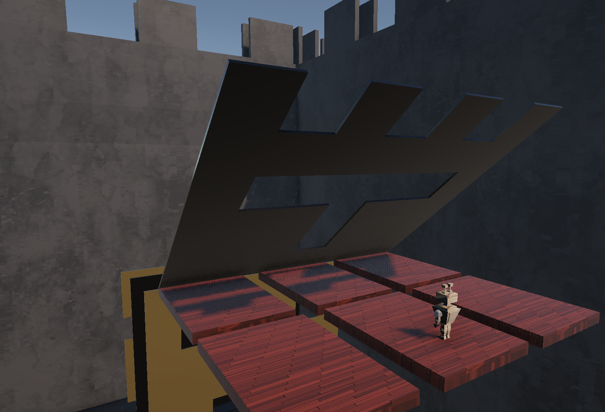
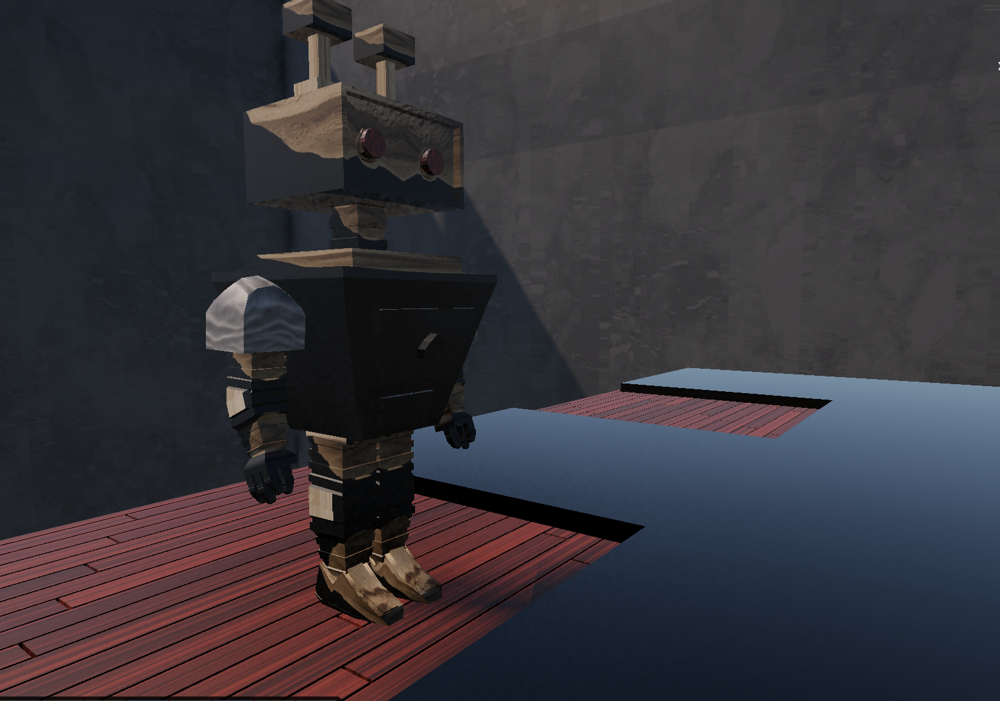

# Platform Survival Game

  
  

This project is a Unity-based mini-game inspired by the Book Squirm minigame from Mario Party 4 In that original concept, players must run across the pages of a book while they continuously close, forcing them to pass through specific shapes or gaps to avoid being crushed.

This project recreates that core survival mechanic but with a completely different visual and gameplay approach. Instead of a book environment, the game takes place on wooden-style platforms within a closed arena. The traditional closing pages have been replaced by dynamic walls that move forward and contain different cut-out shapes, requiring the player to quickly position themselves in the correct space.

If the player fails to align with the open gaps in time, they will be crushed by the walls or fall off the platforms into the void. This creates a constant sense of pressure and reaction-based gameplay.

The player controls a custom-designed robot character, replacing the classic Mario-style characters with an original creative design. Movement, timing, and spatial awareness are essential to survive each incoming obstacle.

Key features of the project include:

Survival mechanics inspired by Mario Party 4 – Book Squirm
Dynamic moving walls with shape-based gaps
Platform-based level design with jumping mechanics
Custom robot player character
Environmental redesign using wooden platforms and enclosed structures
Audio integration to enhance immersion
Organized Unity project structure and version control using GitHub

This project demonstrates the application of core game development concepts such as player control, collision detection, physics interaction, level design, and real-time obstacle systems.

Developed by Camilo González.
